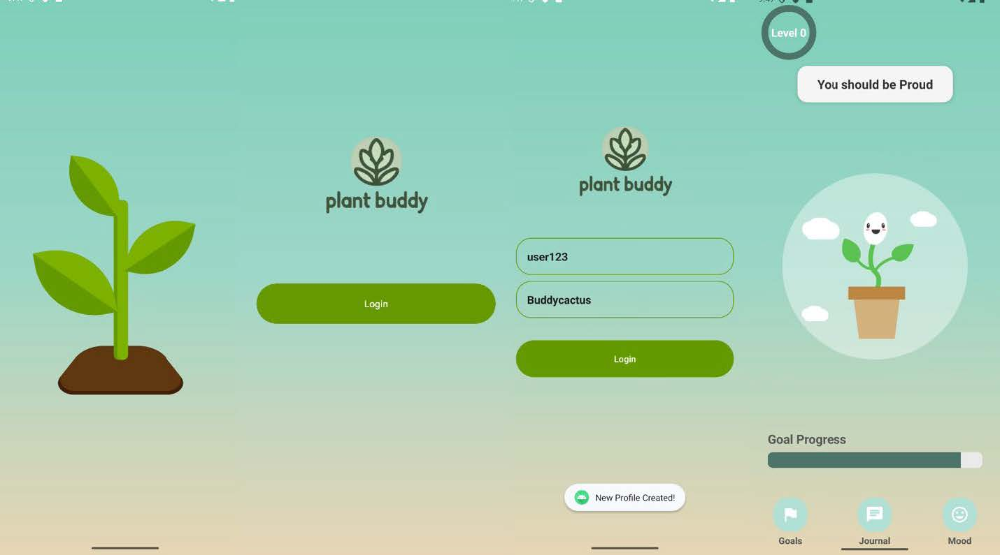
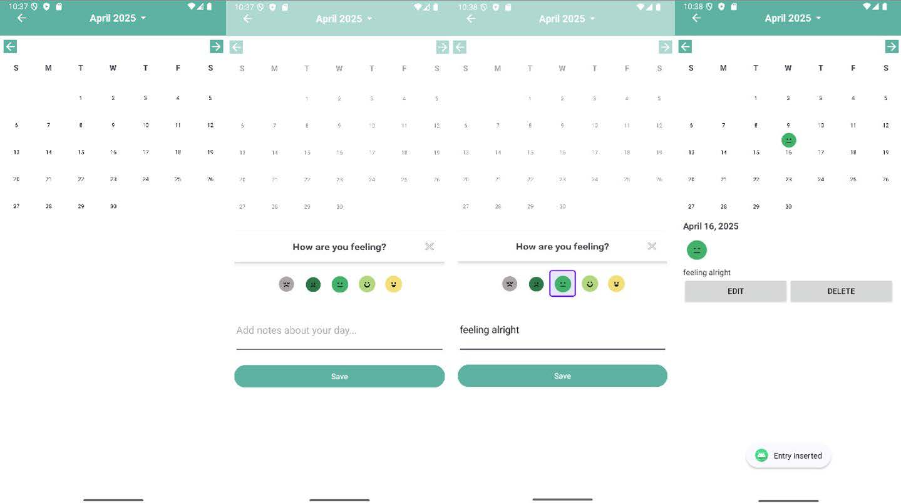
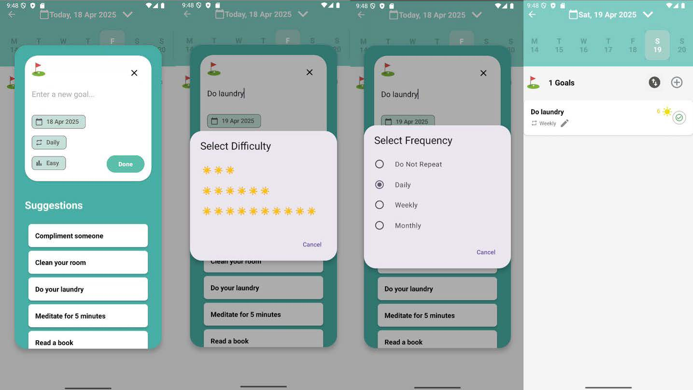

# Plant Buddy, a self-care mobile app
A mobile application built with Java to support mindfulness, emotional wellness, and daily self-care routines.

## Background
The current fast-paced lifestyle in Singapore causes many individuals to struggle with maintaining consistent self-care habits due to lack of time, motivation and access to supportive resources. Traditional mental health support systems require in-person or video call interactions which can be inconvenient and uncomfortable for some. Despite the increase in mental health awareness in current society, there is few interactive and entertaining self-care activities. As a result, many people still lack the motivation and consistency to adopt self-care habits.

Hence, our problem statement is:

**How might we encourage individuals to engage in good self-care habits?**

## Solution
To address this issue, our team decided to create a self-care app called PlantBuddy to promote healthy habits and emotional wellness. The app enables users to track their moods, set personalised self-care goals. A unique feature to PlantBuddy is the growth of a virtual plant companion that grows whenever the user completes their self-care goals.
PlantBuddy offers a discreet and convenient way for users to engage in mental health support anytime and anywhere, eliminating the need for face-to-face interactions. By making mental health care more approachable in a friendly and gamified manner, PlantBuddy seeks to reduce the stigma and encourage a more proactive approach to self-care.

## Resources Used
This project utilised a combination of official documentation, third-party libraries and development tools for implementation. Key resources include:
- Android Developers Documentation – guidance on components, UI practices
- Room Persistence Library – used for local database operations
- LottieFiles – used for animations by official LottieFiles documentation
- GeeksforGeeks – reference for Java concepts and design patterns understanding
- GitHub – for collaboration and troubleshooting issues
- ChatGPT & Claude – used for debugging and to research on ways to implement certain functions/provide suggestions
- Android Studio – the IDE used for development and debugging
- Samsung A15 5G is used for our final demonstration at the SUTD ISTD Showcase 2025

## Contribution to Sustainability, Diversity, and Inclusion
PlantBuddy contributes to sustainability by promoting mental well-being which is an essential component of the United Nations’ Sustainable Development Goal 3: Good Health and Well-Being (SDG 3). The app provides inclusivity by offering a personalised platform accessible to users of all backgrounds and abilities. Embracing a flexible design, PlantBuddy empowers individuals to improve their self-care habits in their own unique ways.

## Key Features
- Personalised Plant Companion: Name it, Raise it
- Mood Tracker: Log your mood and reflections to track emotional trends
- Goal Tracker: Manage your customised goals, watch your progress over time

## Tech Stack
- Language: Java
- Platform: Android SDK
- Database: SQLite (local)
- UI: XML-based layouts with a user-friendly design

## Screenshots
Feature 1: Plant Companion

Feature 2: Mood Tracker

Feature 3: Goal Tracker

## Running the project locally
1. Clone the repository
2. Open in **Android Studio**
3. Build and run on an emulator or Android device (**Final code is in branch: `masterV7`**)
